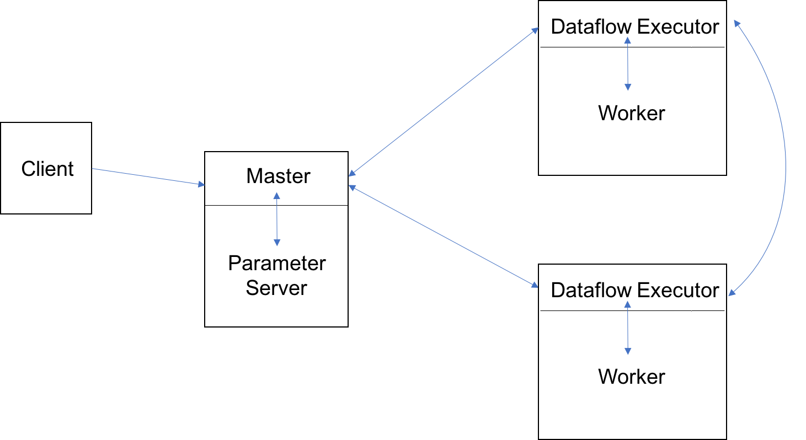

# EECS598 Assignment2: A Flow of Tensors

### *Gain a hands-on understanding of TensorFlow*
##

### Due: Nov 13, 2017, 11:59 PM

## Overview
[TensorFlow](https://www.tensorflow.org/) is an open source software library for numerical computation using data flow graphs. As a successor to [DistBelief](https://static.googleusercontent.com/media/research.google.com/en//archive/large_deep_networks_nips2012.pdf), TensorFlow was originally designed to build a machine learning system that operates at
large scale and in heterogeneous environments. TensorFlow
uses dataflow graphs to represent computation,
shared states, and the operations that mutate the states. It
maps the nodes of a dataflow graph across many machines
in a cluster, and within a machine across multiple computational
devices, including multicore CPUs, general-purpose
GPUs, and ASICs called TensorFlow Processing Units (TPUs). 

Like Assignment 1, you will do your assignment in CouldLab with the specific profile we provide you.
Use `tensorflow_cluster` under `Michigan-BigData` project to start your experiment,
and you should still follow the CloudLab usage policies we mentioned in [Assignment 0](/Assignments/Assignment0/README.md).

In this assignment, you will be given a few machine learning workloads written in TensorFlow. 
You will start with setting up the cluster and running workloads on a single machine. 
You will be asked to do some profiling to get familiar with TensorFlow. The next task is to modify the workloads so that they can be launched in a distributed way. 
We will provides you with detailed instructions on how to do it, but do keep in mind that TensorFlow has a steep learning curve, 
and there are many low-level APIs that you may want to get familiar with when doing this assignment. 
The information provided in this spec is limited, so you should find more tutorials online (for example, in the official documents) whenever you feel it is needed.

## Learning Outcomes
After completing this programming assignment, students should be able to:

* Describe how TensorFlow operates at a high level and how its frequently used APIs work.
* Deploy a small TensorFlow cluster to be able to accept TensorFlow jobs.
* Distribute a single-machine TensorFlow workload into the cluster you deploy.

## Overall Architecture

In this section, we give a brief introduction of the overall architecure of TensorFlow and how it works in a high level. You are encouraged to read more elsewhere (official documents, papers, etc.) to consolidate your understand in TensorFlow. To start a TensorFlow workload, users first write the client TensorFlow program that builds the computation graph. The client program then creates the session and starts the work (training process in our case). In a single-machine TensorFlow setting, TensorFlow includes a session implemented to communicate only with the local device.

In a distributed TensorFlow setting as shown below, the session that the client program creates will send the graph definition to the distributed master via a protocol buffer. 
When the client evaluates a node or nodes in the graph, the evaluation triggers a call to the distributed master to initiate computation.
The main responsibility of the distributed master is to partition the graph and send subgraphs to the workers. 
The dataflow executor in each worker node handles requests from the master, and schedules the execution of the kernels that comprise a local subgraph. Each worker completes the task in parallel, and the communication among the workers is done via some send and receive nodes inserted by the distributed master.
In the diagram, `parameter server` is a type of worker node who is responsible for storing and updating the model's parameters. 
A parameter server is not required in a distributed setting, but it can provide better network utilization.



## Environment Setup
Like what you did in Assignment 1, you will be doing this assignment in CloudLab. You will be using `tensorflow-cluster` profile under `Michigan-BigData` project to start your experiment. 

You need to manually install TensorFlow on every node in your cluster. Building TensorFlow is simple:
```bash
sudo apt-get update
sudo apt-get install python-pip python-dev
sudo pip install tensorflow
```

### Task 1: TensorFlow in A Single Node
In this assignment, we provide you two machine learning workloads. 
One implements AlexNet, a type of a convolutional neural network. The other one implements a type of deep convolutional network called VGGNet. 
In the group directory, we have provided you with the single-machine version of these two workloads, as well as a script, `startserver.py`, 
which contains the [cluster specification](https://www.tensorflow.org/api_docs/python/tf/train/ClusterSpec) and can be used to start your cluster. 
First copy everything under `/proj/michigan-bigdata-PG0/assignments/assignments2/` to your home directory and start from there.
Do keep in mind you need to modify `startserver.py` according to your cluster specification in order to use it. You can also write your own scripts to start your cluster.
The TensorFlow code we provide may seem a bit complicated when you first look at it. 
In this assignment, we do not focus on machine learning concepts, so it is fine if you do not follow how the AlexNet and VggNet is implemented in the code, but you should first take some time to read through the code to get a sense of what is going on in a high level, and how input parameters are passed through function calls, as well as how they affect the program.

To start training AlexNet on a single machine, first use the `startserver.py` script to start the device. 
If you choose to use the script we give you, you can do:
```
python startserver.py --deploy_mode=single 
```
Then launch the TensorFlow client program:
```
python -m hybridalex.scripts.train --network alexnet --mode 1dev
```
You may want to use two terminals to run the above two commands speparately.

Use the default batch size and batch number, answer the following questions:

**Question 1.** Run AlexNet training on a single node in your cluster with the default parameter settings, what is the completion time of the training task?
Record the CPU usage and memory usage when the program is running. Use your favorite software tool to generate one plot for CPU usage and one plot for memory usage.

**Question 2.** Repeat the training process in Question 1, but save the checkpoint every other training step. Record the completion time.
How expensive is checkpointing in this case? You only change the checkpointing setting in this question throughout the entire assignment.

**Question 3.** Only in this question, change the batch size to 256 and batch number to 48 and re-run the training process in Question 1. Explain the results you observe.
For this question, also generate the CPU and memory plots.

**Question 4.** [TensorBoard](https://www.tensorflow.org/get_started/graph_viz) is a suite of visulization tools to created to help users understand TensorFlow graph. 
Use TensorBoard to visualize the graph created in the AlexNet trainning process you just ran.
The necessary logging has already been included in the code we provide you, so you simply [launch TensorBoard](https://www.tensorflow.org/get_started/summaries_and_tensorboard) to view the graph.
Keep a screenshot of the graph for submission.

**Question 5.** Repeat Question 1 and 4 using VggNet with other parameters set to default.

### Task 2: Distributed TensorFlow

As mentioned earlier, your main goal in this task is to figure out how to modify them to be able to run in a distributed way.
To be specific, you will complete the implentation of `ndev_data` method defined in `hybridalex/nets/alexnethybrid.py` and `hybridalex/nets/vgghybrid.py`. 
To help you get started, we have provided you with instructions to distribute a single-machine workload. You need to follow each steps carefully and pick the right APIs.
Note, you always use 1 parameter server node and multiple worker nodes.

1. Create global steps on the parameter server node. You can use the same method that the single-machine program uses to perform this step.
2. Configure the optimizer using the global step created and the total examples number user passed into `ndev_data`.
3. Construct graph replica by splitting the original tensors into sub tensors. 
You need to create replica for both `images` and `labels`. 
Take a look at how [tf.split](https://www.tensorflow.org/api_docs/python/tf/split) works.
4. For each worker device, create replica by 
	1. building up network layers by calling `alexnet_inference/vgg_inference` using the sub tensors you created in Step 3, and
	2. computing gradients,and collect the gradients and reuse the variable for the next replica. 
For more information on how to reuse variables in TensorFlow, read how TensorFlow [Variables](https://www.tensorflow.org/api_docs/python/tf/Variable) work, 
and considering using [tf.variable_scope](https://www.tensorflow.org/api_docs/python/tf/variable_scope).
5. On the parameter server node, calculate the average accross the gradients you collect. 
You should call `average_gradents` method definded in the `ModuleBuilder` class for this step.
This method will transfer gradients from the worker nodes to the parameter server.
Then apply the gradients with `apply_gradients' on the parameter server the same way single-machine would do it.
6. Finally, return the same parameters as the single-machine version code does.

Answer the following questions after you finish implementing the distributed version of AlexNet and VggNet.

**Question 6.** Run distributed AlexNet training using 1 parameter server and 2 workers. 
Record the completion time of the task and compare with the result you get in Question 1. Consider what batch size you should set for a fair comparison.
Also plot CPU and memory usage for your parameter server node. Keep a screenshot of the graph visulized by TensorBoard for submission.

**Question 7.** Repeat Question 6 using 1 parameter server and 4 workers. You will need to submit the CPU and memory plots as well as the TensorBoard graph.

**Question 8.** Repeart Question 7 using 1 the distributed VggNet training you wrote.

**Question 9. (Bonus)** How many hours have you spent in this assignment?

## Submission Instructions
You are going to email a tar.gz file to `eecs598-bigdata-staff@umich.edu`, which contains the code you wrote/modified in this assignment. (You should only need to modify `hybridalex/nets/alexnethybrid.py` and `hybridalex/nets/vgghybrid.py`.)
Create a `README` to put answers to all the questions in this assignment.
Also include the plots (CPU/memory plots and TensorBoard graphs) with names that are easily recognized.

## Acknowledgements

This assignment uses source code written by Peifeng Yu, and we thank Peifeng for his continuous support in creating this assignment.
